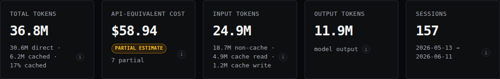
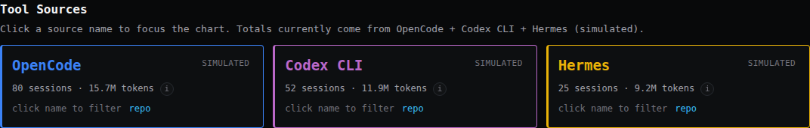
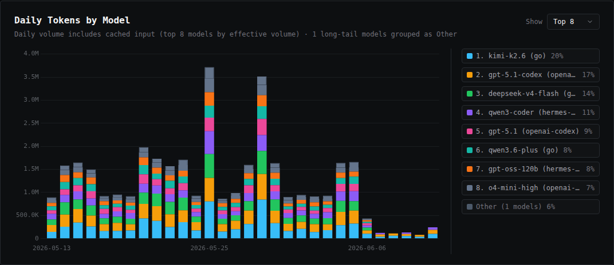
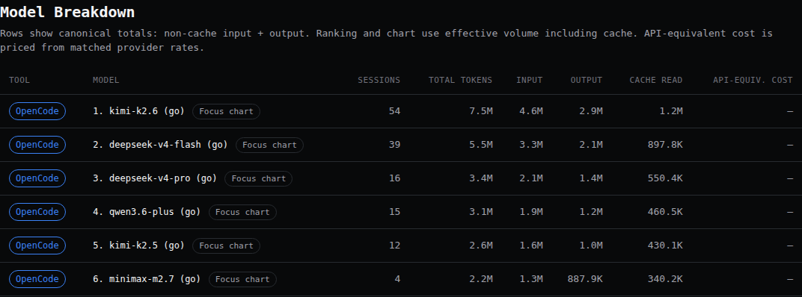
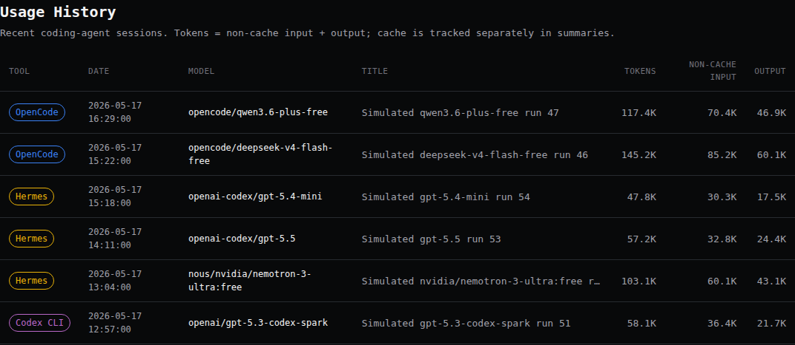

# Coding Agent Usage Dashboard

Local dashboard for inspecting coding-agent usage from your machine.

## Data Sources

Right now the active sources are:

- OpenCode via `~/.local/share/opencode/opencode.db`
- Codex CLI via `~/.codex/state_5.sqlite` plus rollout JSONL files referenced by that state DB
- Hermes via `~/.hermes/state.db`
- Cursor via `~/Library/Application Support/Cursor/User/globalStorage/state.vscdb`

## Setup

### 1. Install uv

This repo uses [uv](https://docs.astral.sh/uv/) as a proper project environment,
so the committed `pyproject.toml` and `uv.lock` are the source of truth for a
reproducible local setup.

```bash
# macOS / Linux
curl -LsSf https://astral.sh/uv/install.sh | sh

# alternative
pip install uv
```

### 2. Sync the project environment

```bash
cd coding-agent-usage-dashboard
uv sync
```

That creates the local environment from the committed lockfile.

### 3. Run the dashboard

```bash
uv run python app.py
```

Then open:

```text
http://localhost:8321
```

For a deterministic fake dataset that is useful for screenshots and UI checks,
open:

```text
http://localhost:8321/?simulate=1
```

## Screenshots

All screenshots use the simulated dataset from `?simulate=1`, so the examples are deterministic for docs, screenshots, and regression checks.

### Overview



The overview cards show full token volume, API-equivalent estimated cost, input/output split, and session count for the selected range. Sources that do not expose local cache or model metadata still appear with explicit unavailable-state provenance instead of guessed values.

### Tool Sources



Tool Sources shows how OpenCode, Codex CLI, Hermes, and Cursor can appear in one dashboard while keeping source provenance visible.

### Daily Tokens by Model



Daily Tokens by Model shows stacked model usage over time, with categorical colors and source filtering.

### Model Breakdown



Model Breakdown lists sessions, token totals, cache read, and pricing status per model. Table totals use session-token semantics: non-cache input plus output.

### Usage History



Usage History shows recent sessions with source, date, model, title, and token details.

## Current data rules

- active sources: OpenCode local SQLite DB, Codex local state DB plus rollout JSONL, Hermes local session DB, and Cursor local global-storage state DB when present
- Overview `Total Tokens` = non-cache input + output assistant-message tokens + cache read/write
- session and model-history totals use session-token semantics: non-cache input + output assistant-message tokens
- API-equivalent estimated cost is based on matched public provider pricing, not necessarily actual subscription spend
- unmatched model pricing stays unpriced instead of guessed
- Cursor token totals come from Cursor `composerData` assistant-bubble `tokenCount` fields; trusted Cursor cache metrics and model IDs remain unavailable locally

See [source contracts](docs/source-contracts.md) for adapter-specific field and token rules.
